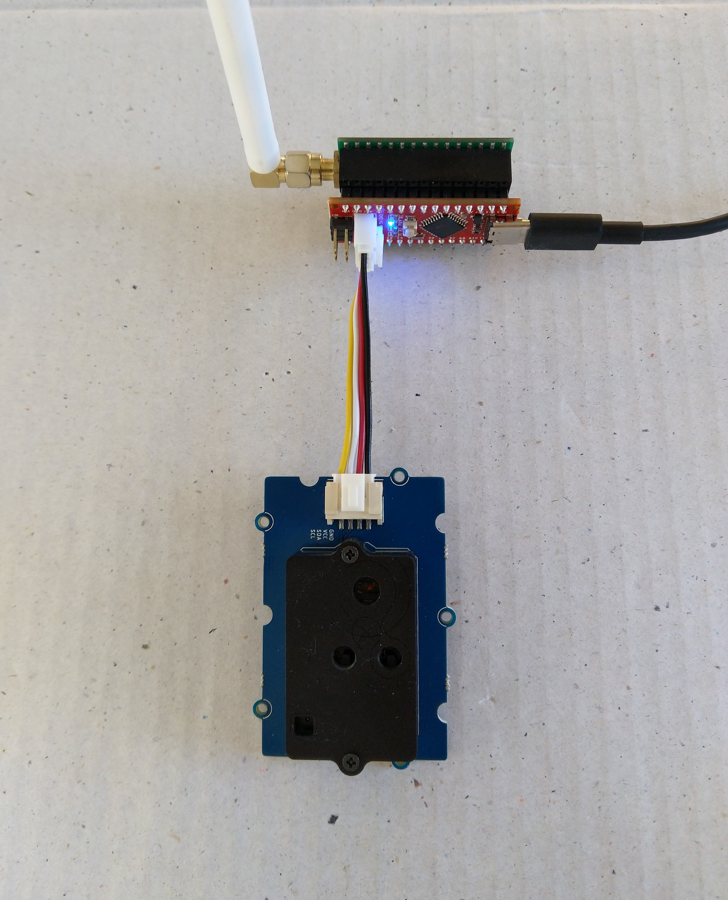

# FieldGateway.LoRa.SeeeduinoNanoEasySensorsClientCO2

[Arduino Nano](https://www.arduino.cc/en/Guide/ArduinoNano), EasySensors RFM95 shield, temperature, humidity and CO2 monitor sensor node for my Windows 10 IoT Core [LoRa](https://lora-alliance.org/) field gateways

I used the [Arduino-Lora](https://github.com/sandeepmistry/arduino-LoRa), [Sparkfun ATSHA204](https://github.com/sparkfun/SparkFun_ATSHA204_Arduino_Library) and [Sensiron SCD30](https://github.com/Seeed-Studio/Seeed_SCD30) libraries, thank you to the authors Sandeep Mistry, Sparkfun & Seeedstudio.

My Arduino Nano clients uses
* [Arduino Nano radio shield RFM95](https://www.tindie.com/products/easySensors/arduino-nano-radio-shield-rfm6995-or-nrf24l01/) 
* [Grove - CO2, Temperature & Humidity Sensor (SCD30)](https://www.seeedstudio.com/Grove-CO2-Temperature-Humidity-Sensor-SCD30-p-2911.html)
* [Seeeduino nano](https://www.seeedstudio.com/Seeeduino-Nano-p-4111.html)

Detailed blog [post](https://blog.devmobile.co.nz/2019/08/14/grove-carbon-dioxide-sensorscd30-trial/)
